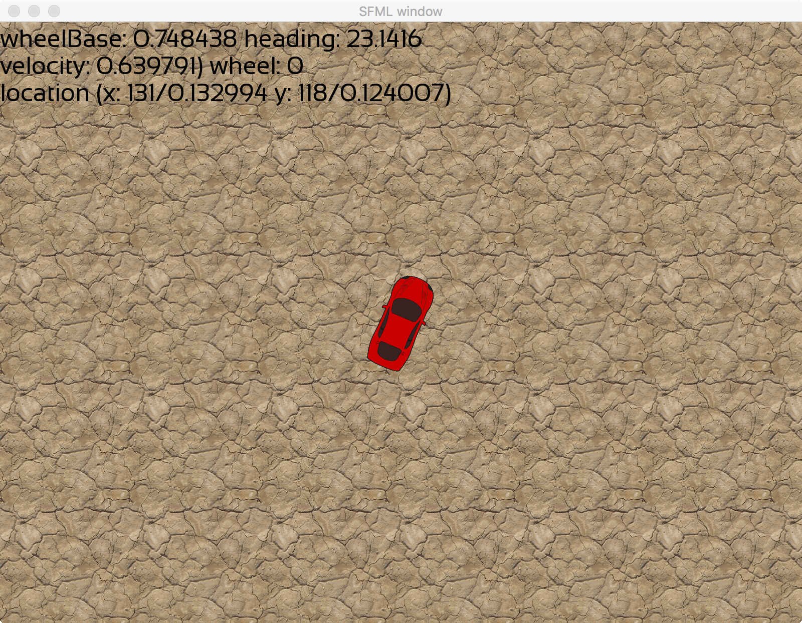

Wow, it's been over 6 months since I looked at this project. I'm going to work on it again. For now, this README.md is going to be for train-of thought planning, but I will move that off to a blog-type file later.

# What is cargame? #
When I took my first OO programing class, the class assignments involved building an asteroids-like shooter game. I had a lot of fun doing that, and really tweaked my game out with some cool ideas. The code, however, is terrible: I implemented features before understanding OO concepts. I considered refactoring it, but I want to build something a little different. Thus was born cargame.
cargame may eventually be a top-down shooter/driving simulator/rpg. Kind of like the old Autoduel game from the 80s meets Escape Velocity. But I'm going to build it in little bites.
Features I want in it:
* Persistent world. I want wrecks, enviromental damage, and even skid marks to persist in the world. I have some ideas of how to do this, but am not sure of the memory and i/o requirements of saving and loading ridiculous numbers of mutable textures. Best idea so far for skid marks/tire tracks: save as vectors, paint strokes on the fly. Hopefully my work on Cairus will help with that.
* Procedural world. I think a randomly generated and infinite world would be really neat. We'll see.
* 2D top down driving simulator, controlled with one hand on the keyboard. I want physics that makes sense, with intuitive controls that are easy to learn. For example, when you are driving on a road, and steer close to driving in a lane, the game should intuit that you want to be in that lane and make a microadjustment  to line up the car with the lane. I want cars to be able to skid, drift, etc as appropriate to the surface being driven on.
* shooter. The mouse hand should control your view and targetting. Move the cursor far from the car and the view zooms out, move it close and it zooms in. Move it faster than weapons can track, and the targetting reticle should separate from the mouse cursor until it catches up.
* RPG. Missions/quests. I'm not sure how this will work with a procedurally generated world. I may have story mode and sandbox mode.

## Where is progress now? ##
Very early in development of a topdown 2D driving simulator. You can drive a car on a featureless desert made up of repeating tiles. Accelerate with W, break with S, steer left and right with A and D, or use a lighter touch by steering with Q and E.

## What's next? ##
Skidding. I'm not happy with modeling the car as a single entity, so I think I want to model each wheel (well, not rotation, but point of contact and direction of roll) so I can account for differing coefficients of friction for each wheel (varying with terrain and static rolling or dynamic skidding friction).
